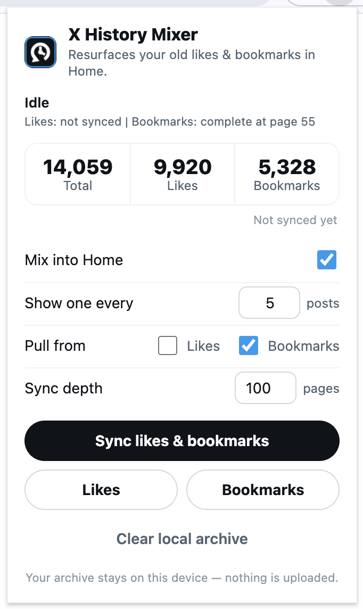

# X History Mixer

A local-only Chrome extension that resurfaces your own old **likes** and **bookmarks**
inside the X (Twitter) Home timeline. It quietly fetches your archive using your
already-logged-in session, stores it on your device, and sprinkles a random
historical post in between the live ones every few tweets — a little hit of
nostalgia while you scroll.

> Everything stays on your machine. Your posts are never sent to any server other
> than X's own API, which your browser already talks to.

## What it looks like

<table align="center">
  <tr valign="top">
    <td align="center">
      <br>
      <sub><b>A saved post, mixed right into your Home feed</b></sub>
    </td>
    <td align="center">
      <br>
      <sub><b>One click to sync and tune the mix</b></sub>
    </td>
  </tr>
</table>

## Features

- **Mixes memories into Home** — inserts one of your archived posts every _N_ native tweets.
- **Likes, bookmarks, or both** — choose which sources to pull from.
- **Fully local archive** — stored in the extension's own IndexedDB; nothing is uploaded.
- **Resumable sync** — long syncs can be stopped and picked back up where they left off.
- **Scroll-position safe** — keeps your place in the feed when you open a post and come back.
- **Native look** — cards match X's light, dim, and lights-out themes.

## Install (from source)

This isn't on the Chrome Web Store — load it unpacked:

1. Clone or download this repository.
2. Open `chrome://extensions` in a Chromium browser (Chrome, Edge, Brave, Arc…).
3. Turn on **Developer mode** (top-right).
4. Click **Load unpacked** and select the folder containing `manifest.json`.
5. Open or reload [`https://x.com/home`](https://x.com/home).
6. Click the extension icon and run **Sync likes & bookmarks**.

The first sync can take a while depending on how much history you have. You can
keep using X while it runs, and stop/resume it from the popup any time.

## Usage

Open the popup (toolbar icon) to:

- **Mix into Home** — toggle insertion on or off.
- **Show one every _N_ posts** — insertion cadence (default: every 5 native posts).
- **Pull from** — likes, bookmarks, or both.
- **Sync depth** — how many pages to fetch per source (X returns up to 100 items per page).
- **Sync / Stop / Clear local archive** — manage your local copy.

## How it works

- A content script reads which posts X has rendered on `/home` and inserts your
  archived cards between them, keeping your scroll position stable.
- A page-bridge script (running in the page context) calls X's own GraphQL
  endpoints — the same ones the website uses — with your existing session
  cookies to page through your likes and bookmarks.
- Because X's private web API and operation IDs change over time, the extension
  discovers the current query IDs and bearer token from X's own loaded
  JavaScript bundles instead of hard-coding them.
- Fetched posts are normalized and stored in IndexedDB under the extension's
  origin. Settings, status, and sync progress live in `chrome.storage.local`.

## Privacy & permissions

Your archive and settings never leave your device. The extension talks only to
X's own domains. Here's why each permission is requested:

| Permission | Why it's needed |
| --- | --- |
| `storage` | Save your settings, sync progress, and archive locally. |
| `activeTab`, `tabs` | Let the popup send sync commands to your open x.com tab. |
| `https://x.com/*`, `https://twitter.com/*` | Run on X and call X's API as your logged-in session. |
| `https://abs.twimg.com/*` | Read X's own JS bundles to discover the current API query IDs. |

To remove everything, use **Clear local archive** in the popup, then uninstall
the extension (which drops its IndexedDB and storage).

## Limitations

- X can change its private web API at any time; a major frontend change can break
  sync until the extension is updated.
- Long syncs may be rate-limited by X. If that happens, wait a bit and resume.
- Deleted, private, suspended, or otherwise unavailable posts can't be archived.

## Troubleshooting

- **Sync fails or finds nothing** — reload `https://x.com` (so fresh bundles load)
  and make sure you're logged in, then try again.
- **No cards appear** — confirm **Mix into Home** is on, you're on `/home`, and
  your archive count is above zero.
- **Inspect logs** — open DevTools on the X tab (content/page scripts) and on the
  extension's service worker (via `chrome://extensions` → _Inspect views_).

## Development

No build step — it's plain MV3 + vanilla JS/CSS. Edit the files and hit
**Reload** on `chrome://extensions`.

```
manifest.json        Extension manifest (MV3)
src/content.js       Timeline mixing, card rendering, scroll restoration
src/page-bridge.js   X GraphQL access from the page context
src/background.js     Service worker: messaging, metadata discovery, counts
src/idb.js           IndexedDB archive store
src/timeline.css     Injected card styles
popup/               Toolbar popup UI
icons/               Extension icons
```

## Disclaimer

This is an independent, unofficial project. It is **not affiliated with,
endorsed by, or sponsored by X Corp.** It uses X's private web API with your own
logged-in session — the same requests the website makes — which may break without
notice and could conflict with X's Terms of Service. Use it at your own risk.

## License

[MIT](./LICENSE)
